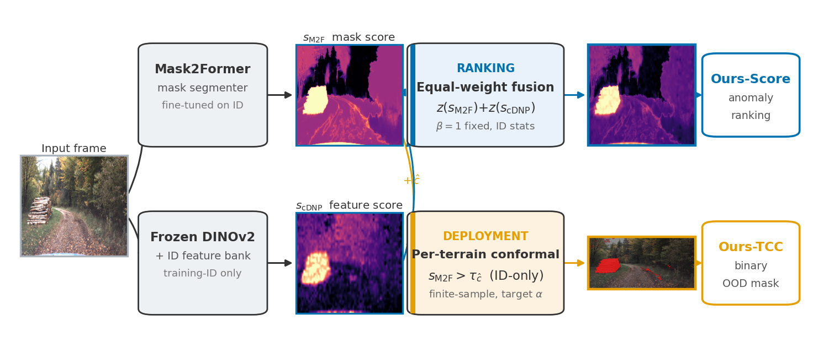

# OffRoad-OOD

**Benchmarking and Terrain-Conditional Calibration for Off-Road OOD Segmentation.**

A leakage-free, multi-dataset benchmark for semantic out-of-distribution (OOD)
segmentation in off-road navigation, together with an ID-only, terrain-conditional
operating point (Ours-TCC) for deployment.

This repository accompanies our ICRA submission. It provides the benchmark
construction (ID/OOD ontology and leakage-free splits over four public off-road
datasets), the full evaluation suite, and all baselines and our method. Every
script writes its results as JSON to `results/`, reproducing the numbers reported
in the paper. (The plotting/LaTeX code that renders those numbers into the
paper's figures and tables is not part of this release.)

> **Anonymized for double-blind review.** No author-, institution-, or
> path-identifying information is included. Paths are resolved from the
> `OFFROAD_OOD_ROOT` environment variable (default: current directory).

> **We do not redistribute raw images.** OffRoad-OOD is a *task, protocol, and
> evaluation layer* on top of four existing public datasets. We release the
> derived artifacts (ontology mapping, split files, code); you download the
> images from their original sources (below). See [`DATASHEET.md`](DATASHEET.md)
> for the full benchmark-construction documentation.

---

## Method overview

<!-- Placeholder: replace docs/method_overview.png with the final method figure (keep the same path). -->


Both configurations share one front end — a Mask2Former mask-transformer
(fine-tuned on ID) and a frozen DINOv2 encoder with an ID feature bank.
Mask2Former yields the mask anomaly score `s_M2F` and the predicted terrain
class `ĉ`; DINOv2 yields the feature-distance score `s_cDNP`.

- **Ours-Score (ranking).** The fixed equal-weight fusion
  `z_ID(s_M2F) + z_ID(s_cDNP)` (β=1, standardized on validation-ID pixels only) —
  a threshold-free anomaly score, produced by `ours_score_final.py`.
- **Ours-TCC (deployment).** A terrain-conditional, ID-only finite-sample
  conformal threshold applied to the mask score: flag a pixel when
  `s_M2F > τ_ĉ`, with `τ_ĉ` calibrated per predicted terrain class at a target
  FPR α — produced by `tcc_fused.py`.

Ranking and calibration are deliberately separated: the feature cue improves the
*ranking* score, while the *operating point* is set on the mask score alone,
which transfers better under site shift.

---

## 1. Installation

```bash
python -m venv .venv && source .venv/bin/activate
pip install -r requirements.txt
export OFFROAD_OOD_ROOT=$(pwd)     # repo root: holds configs/ data/ results/
export PYTHONPATH=offroad_ood      # modules are importable
```

Tested with Python 3.11, PyTorch 2.x, CUDA 12.x. Training uses a single GPU
(V100/A100 class); per-pixel feature and calibration steps run on CPU from
cached scores.

## 2. Get the data

Download each dataset from its original source into `data/` (respecting each
license — see `DATASHEET.md` §Licenses):

| Dataset | Source | License |
|---|---|---|
| GOOSE | `goose-dataset.de` | CC BY-SA 4.0 |
| RELLIS-3D | `github.com/unmannedlab/RELLIS-3D` | CC BY-NC-SA 3.0 |
| WildScenes | CSIRO Data Access Portal (`data.csiro.au`) | CC BY (CSIRO) |
| RUGD | `rugd.vision` | research use |

Expected layout: `data/goose/`, `data/rellis3d/`, `data/wildscenes/`,
`data/rugd/`. The dataset loaders (`goose_dataset.py`, etc.) document the exact
file structure they expect.

## 3. Reproduce the benchmark

All commands are run from the repo root with the two env vars set above.
Datasets are selected with `--dataset {goose,rellis,wildscenes,rugd}`.

```bash
# (a) Build / verify leakage-free splits (splits are also shipped in configs/)
python offroad_ood/plan_split.py            # GOOSE site-level split + audit
python offroad_ood/audit_goose.py           # GOOSE feasibility & leakage checks
python offroad_ood/audit_wildscenes.py      # WildScenes anomaly-frame feasibility check

# (b) Per-pixel baselines on frozen DINOv2 features
python offroad_ood/dinov2_baseline.py --dataset goose   # kNN
python offroad_ood/cdnp_eval.py       --dataset goose   # cDNP (top-k)
python offroad_ood/mahalanobis.py     --dataset goose

# (c) Closed-set heads → per-pixel logit scores (MSP/MaxLogit/Energy/SML)
python offroad_ood/train_seghead.py   --dataset goose
python offroad_ood/eval_seghead.py    --dataset goose
python offroad_ood/segformer_train.py --dataset goose   # end-to-end per-pixel
python offroad_ood/segformer_eval.py  --dataset goose

# outlier-exposure track (MSP OE-trained row): paste COCO objects during head training
python offroad_ood/train_seghead_oe.py --dataset goose --lam_oe 0.5   # OE head (needs COCO in data/coco/)
python offroad_ood/eval_seghead.py     --dataset goose --oe           # OE-trained MSP scores

# (d) Mask-transformer (Mask2Former): RbA and MSP-M2F
python offroad_ood/m2f_train.py       --dataset goose
python offroad_ood/m2f_rba_eval.py    --dataset goose

# (e) Our method: Ours-Score (fixed beta=1 fusion, ranking) + Ours-TCC
#     (finite-sample terrain-conditional conformal on the mask score, deployment)
python offroad_ood/m2f_dump_predclass.py --dataset goose        # MSP-M2F score + predicted terrain class
python offroad_ood/tcc_fused.py          --dataset all          # Ours-TCC + global-conformal & fused-TCC ablations + per-terrain FPR uniformity
python offroad_ood/ours_score_final.py   --dataset all          # Ours-Score (beta=1) AP/FPR95 + bootstrap CIs (main table + competitor)
python offroad_ood/method_final.py       --dataset goose        # (ablation) OOD-tuned beta, oracle upper bound
python offroad_ood/conformal_headroom.py --dataset goose        # (reference) percentile-quantile conformal

# (f) Diagnostic analyses behind Section V (why off-road OOD is hard)
python offroad_ood/analyze_fp_all.py     --dataset goose   # terrain false-positive breakdown
python offroad_ood/veg_fprate.py                           # vegetation vs non-veg false-positive rate
python offroad_ood/veg_featdist.py                         # vegetation vs anomaly feature distance
python offroad_ood/confusion_matrix.py   --dataset goose   # validity: held-out OOD classes are low-confidence under the ID model
python offroad_ood/leakage_ablation.py                     # controlled same-scene leakage test (GOOSE)
python offroad_ood/leakage_ablation_multi.py               # same test across all four datasets (optional)

# (g) Object-level (native resolution), per-tier, cost, CIs, and seed stability
python offroad_ood/component_fullres_all.py --dataset goose  # GPU. native-resolution mean component F1 (main object-level table, all methods)
python offroad_ood/component_f1.py       --dataset goose   # (quarter-res reference) object-level F1: per-pixel scores
python offroad_ood/m2f_component_f1.py   --dataset goose   # (quarter-res reference) object-level F1: mask-transformer
python offroad_ood/ours_component_f1.py  --dataset goose   # (quarter-res reference) object-level F1: fused score
python offroad_ood/m2f_tier_recall.py    --dataset goose   # per-tier recall at the FPR95 point
python offroad_ood/per_tier_ap.py        --dataset goose   # per-tier pixel AP
python offroad_ood/latency_bench.py      --n 50            # inference cost: ms/frame, FPS, params
python offroad_ood/compute_ci.py         --dataset goose   # bootstrap 95% CIs for the main results
python offroad_ood/oe_ci.py                                # bootstrap 95% CI for the outlier-exposure (OE) row (all datasets)
python offroad_ood/method_ci.py          --dataset goose   # bootstrap CI + paired delta for our method
python offroad_ood/method_seed3.py       --dataset goose   # seed mean +/- std stability
```

Repeat (b)–(g) with `--dataset {rellis,wildscenes,rugd}`. Each script writes
JSON to `results/` and is deterministic given the fixed seeds; validation-set
thresholds are never selected on test. See each script's `--help` for options.

**Which "Ours" is which.** The paper's headline detector is **Ours-Score**, the
*fixed* equal-weight fusion (`β=1`, no OOD tuning): its pixel numbers come from
`ours_score_final.py` and its object-level numbers from `component_fullres_all.py`
(native resolution). The deployment operating point is **Ours-TCC**
(`tcc_fused.py`). The scripts `method_final.py`, `method_ci.py` and
`ours_component_f1.py` instead select `β` on validation AP/AUROC; they are the
*oracle-β* ablation (an upper bound that uses validation OOD labels) and the
quarter-resolution references, not the headline numbers.

**Evaluate your own detector.** `run_eval.py` is a method-agnostic harness: give
it a `score_fn(image_rgb) -> HxW anomaly map` and it runs the full evaluation
(pixel AP / AUROC / FPR95 with bootstrap CIs) on a chosen split, so a new method
can be benchmarked under the exact protocol without touching the rest of the code.

## 4. Repository map

```
configs/            Derived benchmark artifacts (releasable):
  meta_ontology.yaml    ID/OOD/ignore ontology + tiers, per dataset
  *_split.json          Leakage-free train/val/test splits
offroad_ood/        All code (flat modules; run with PYTHONPATH=offroad_ood):
  paths.py              Path resolution from OFFROAD_OOD_ROOT
  ontology.py           Ontology parser (single source of truth)
  *_dataset.py          Per-dataset loaders (pixel-masking for train)
  metrics.py            AP / AUROC / FPR95 / component-F1 + bootstrap CI
  <baselines/method>    See §3
  run_eval.py           Method-agnostic harness to benchmark your own detector
docs/               Extended documentation
  method_overview.png   Method figure shown above (replaceable placeholder)
  RUNNING_AT_SCALE.md   Notes for running the suite on a cluster
DATASHEET.md        Full benchmark-construction datasheet
```

## 5. Citation

Anonymized for review. Citation info will be added upon acceptance.
